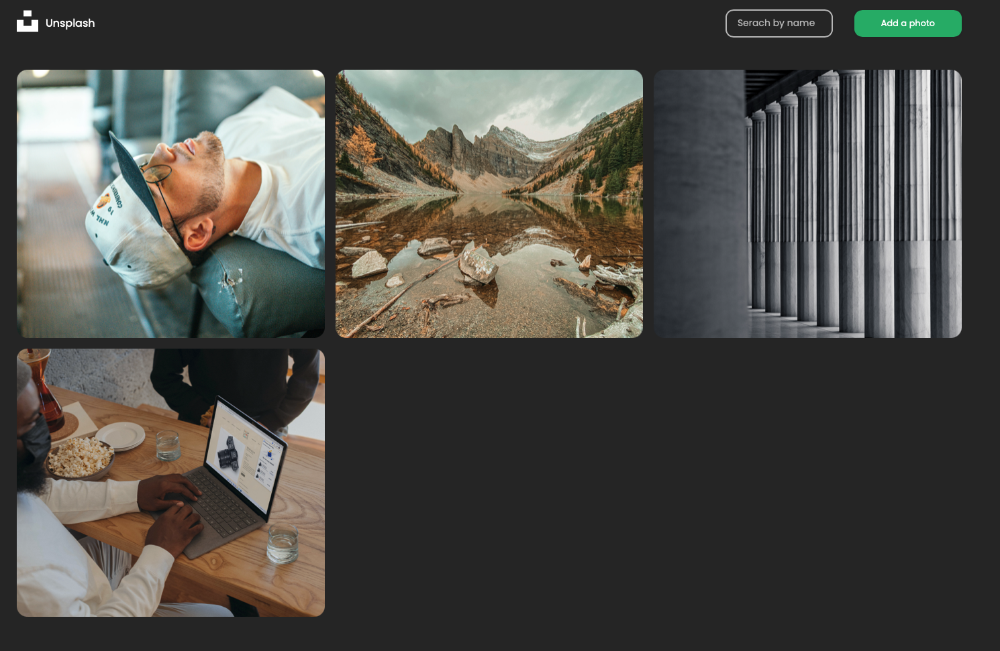

# Unsplash

With validation both in the browser and on the server, this project is a minimaliste Unsplash clone, carried out with `Express`, `Node`, `MongoDB`, `React`, and styled with `Sass`. Quite user friendly, the app allows to upload an image, search instantly among existing images, and finally delete an image.

# Overview

The project is hosted by `Heroku`, et and you can test it by clicking on the link above, in the `Github` about section. With the hope that, some one will find something interesting in this repository, it was your unknown friend !😉

